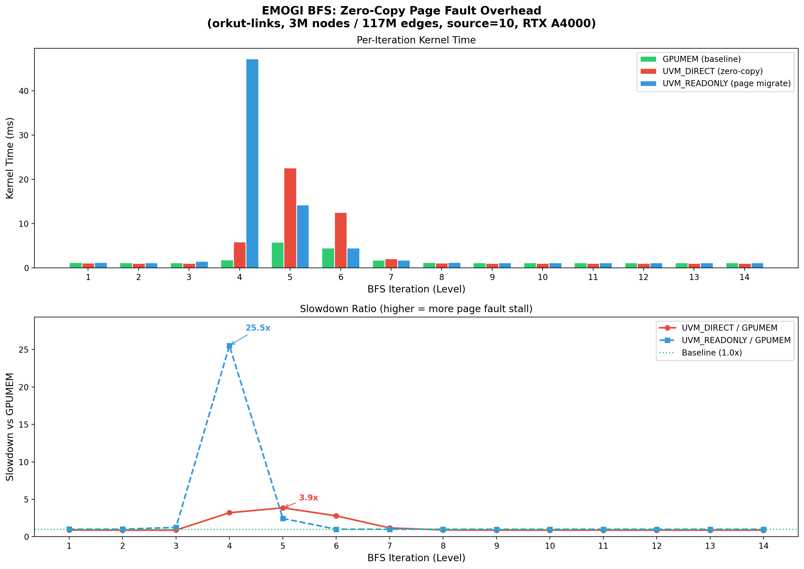
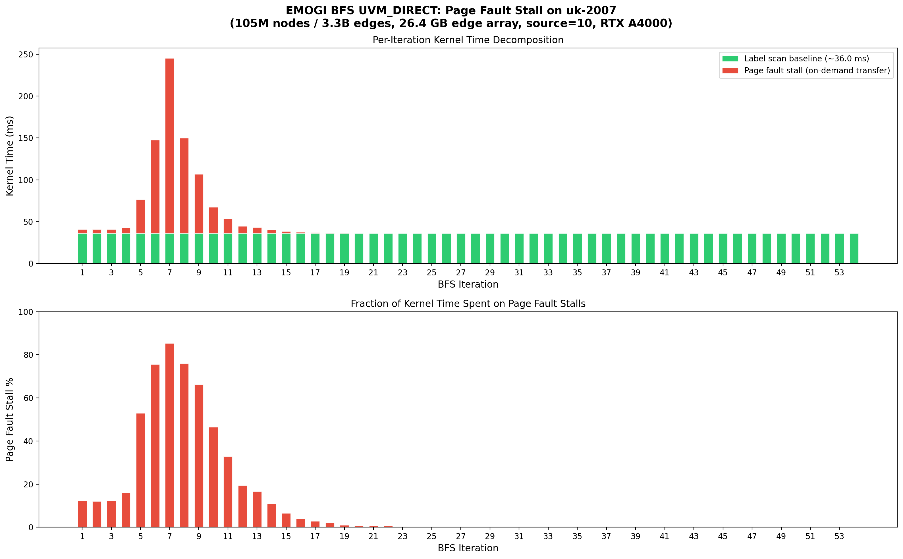
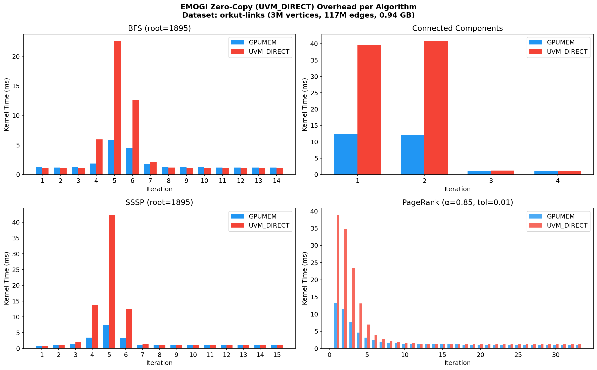
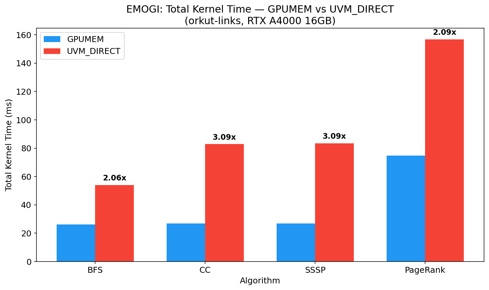
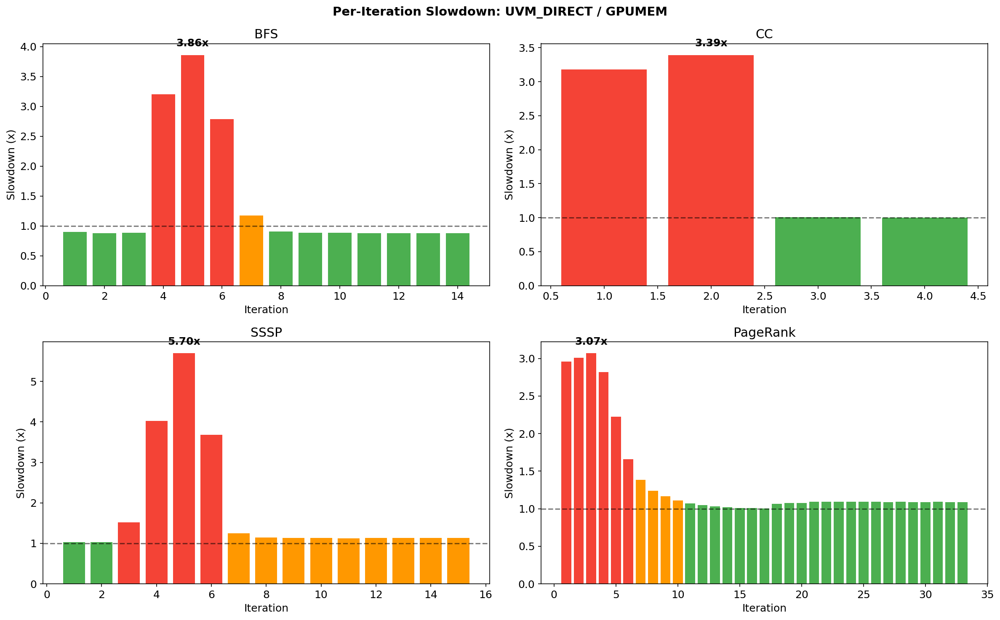

# EMOGI Motivation Experiment: Zero-Copy Page Fault Bottleneck

## 目的

驗證 EMOGI 的 on-demand zero-copy data transfer（`UVM_DIRECT` 模式）在 BFS kernel 執行時，因 page fault 導致 SM stall，**無法與 kernel computation overlap**，從而拖慢整體效能。

## 實驗環境

| 項目 | 規格 |
|---|---|
| GPU | NVIDIA RTX A4000 (sm_86, 16GB VRAM) |
| Datasets | orkut-links.bcsr (3M nodes, 117M edges, 0.94 GB edge array)、uk-2007.bcsr (105M nodes, 3.3B edges, 26.4 GB edge array) |
| Algorithm | BFS (COALESCE kernel, `-t 1`) |
| Source node | 10 |

## 背景：EMOGI 的三種記憶體模式

| 模式 | Flag | 機制 | 特性 |
|---|---|---|---|
| **GPUMEM** | `-m 0` | `cudaMalloc` + `cudaMemcpy` | Edge array 預先完整搬到 GPU，kernel 存取 local memory |
| **UVM_READONLY** | `-m 1` | `cudaMallocManaged` + `SetReadMostly` | 首次存取觸發 page migration 到 GPU，之後從 GPU local 讀取 |
| **UVM_DIRECT** | `-m 2` | `cudaMallocManaged` + `SetAccessedBy` | 不做 page migration，GPU 每次存取都透過 PCIe 直接讀取 host memory |

### EMOGI BFS kernel 的特性

EMOGI 使用 **level-synchronous** BFS：每個 iteration 的 kernel 掃描**所有頂點**（非只掃描 frontier），檢查 `label[tid] == level` 後才存取 edge list。這表示：
- 即使 frontier 很小，kernel 仍需掃描全部 N 個頂點的 label（固定成本）
- 只有 frontier 上的頂點會存取 `edgeList[]`，觸發 page fault（UVM_DIRECT）或 page migration（UVM_READONLY）

### Page fault 無法 overlap 的原因

在 `UVM_DIRECT` 模式下，GPU kernel 存取 `edgeList[i]` 時：
1. 該 warp 發出記憶體請求
2. 若該頁面不在 GPU，觸發 **page fault**
3. 該 SM 的 warp 被 **stall**，等待頁面透過 PCIe 從 host 傳輸
4. 傳輸完成後 warp 才恢復執行

因為 page fault 發生在 kernel **內部**，data transfer 直接嵌入 kernel 執行時間——沒有獨立的 H2D memcpy 可以被 overlap 或 pipeline。

## 實驗方法

### Instrumented 版本

建立 `bfs_profile.cu`，使用 `cudaEvent` 精確測量每個 iteration 的 kernel 執行時間。以 COALESCE kernel 為基準（warp-level coalesced access，EMOGI 推薦的模式）。

### 編譯與執行

```bash
cd EMOGI

# 編譯
nvcc -O3 -gencode arch=compute_86,code=sm_86 -o bfs_profile bfs_profile.cu

# orkut-links: 三種模式比較
./bfs_profile -f ../datasets/KONECT/orkut-links.bcsr -r 10 -m 0   # GPUMEM
./bfs_profile -f ../datasets/KONECT/orkut-links.bcsr -r 10 -m 1   # UVM_READONLY
./bfs_profile -f ../datasets/KONECT/orkut-links.bcsr -r 10 -m 2   # UVM_DIRECT

# uk-2007: UVM_DIRECT only (26.4 GB edge array, 不fit 16GB GPU)
./bfs_profile -f ../datasets/KONECT/uk-2007.bcsr -r 10 -m 2

# nsys timeline profiling
nsys profile --stats=true -t cuda -o nsys_emogi_orkut_gpumem \
    ./bfs_profile -f ../datasets/KONECT/orkut-links.bcsr -r 10 -m 0
nsys profile --stats=true -t cuda -o nsys_emogi_orkut_uvm_direct \
    ./bfs_profile -f ../datasets/KONECT/orkut-links.bcsr -r 10 -m 2
```

### 繪圖

```bash
cd EMOGI/experiments
python3 plot_emogi_profile.py
```

### 分析工具

| 工具 | 用途 |
|---|---|
| `cudaEvent` (per-iter) | 精確測量每個 BFS iteration 的 kernel 執行時間 |
| `nsys` (Nsight Systems) | 捕捉 GPU timeline，觀察 kernel duration、UVM page fault events、PCIe traffic |
| `ncu` (Nsight Compute) | 可進一步分析 stall reason 分佈（memory dependency vs compute） |

---

## 實驗一：orkut-links — GPUMEM vs UVM_DIRECT vs UVM_READONLY

> 圖較小（0.94 GB），可完整放入 GPU 記憶體，提供乾淨的 baseline 比較。

### Per-Iteration Kernel Time

| Iter | Level | GPUMEM (ms) | UVM_DIRECT (ms) | UVM_READONLY (ms) | Slowdown (DIRECT) | Slowdown (RO) |
|-----:|------:|------------:|-----------------:|-------------------:|-------------------:|--------------:|
| 1 | 0 | 1.30 | 1.27 | 1.28 | 0.98x | 0.98x |
| 2 | 1 | 1.20 | 1.20 | 1.22 | 1.00x | 1.02x |
| 3 | 2 | 1.22 | 1.22 | 1.67 | 1.00x | 1.37x |
| **4** | **3** | **1.86** | **5.92** | **48.15** | **3.19x** | **25.9x** |
| **5** | **4** | **5.89** | **22.86** | **14.23** | **3.88x** | **2.42x** |
| **6** | **5** | **4.52** | **12.74** | **4.53** | **2.82x** | **1.00x** |
| 7 | 6 | 1.79 | 2.28 | 1.79 | 1.28x | 1.00x |
| 8-14 | 7-13 | ~1.20 | ~1.20 | ~1.20 | ~1.00x | ~1.00x |

### 總體比較

| 模式 | 總 kernel 時間 | vs GPUMEM |
|---|---|---|
| GPUMEM | 26.19 ms | 1.00x |
| UVM_DIRECT | 54.03 ms | **2.06x** |
| UVM_READONLY | 80.39 ms | **3.07x** |

### 圖表



### 觀察

- **UVM_DIRECT 在 frontier 高峰期（iter 4-6）slowdown 最大**（3-4x），因為大量邊被存取，觸發密集 page fault + PCIe transfer，SM 持續 stall。
- **UVM_READONLY iter 4 暴衝至 25.9x**：首次存取大量頁面時觸發 bulk page migration（host→GPU），遷移完成後 iter 5+ 幾乎回到 GPUMEM 速度。
- **尾端 iteration（8-14）三者幾乎相同**：frontier 為空，kernel 僅掃描 label array（已在 GPU），不觸發 edge list page fault。

---

## 實驗二：uk-2007 — UVM_DIRECT (out-of-memory)

> 26.4 GB edge array 無法放入 16 GB GPU，只能用 UVM 模式。

### Per-Iteration Kernel Time (關鍵 iterations)

| Iter | Level | Kernel (ms) | Est. Stall (ms) | Stall% |
|-----:|------:|------------:|----------------:|-------:|
| 1 | 0 | 43.46 | 7.50 | 17.3% |
| 5 | 4 | 80.42 | 44.46 | 55.3% |
| **6** | **5** | **157.43** | **121.47** | **77.2%** |
| **7** | **6** | **276.91** | **240.95** | **87.0%** |
| **8** | **7** | **168.39** | **132.43** | **78.7%** |
| 9 | 8 | 119.37 | 83.41 | 69.9% |
| 10 | 9 | 73.84 | 37.88 | 51.3% |
| 15 | 14 | 38.75 | 2.79 | 7.2% |
| 20-54 | 19-53 | ~35.94 | ~0.00 | ~0% |

### 總體

| 指標 | 數值 |
|---|---|
| Total iterations | 54 |
| Total kernel time | 2585.70 ms |
| Label scan baseline | ~35.96 ms/iter (105M vertex scan) |
| Page fault stall total | 643.91 ms (**24.9%** of total) |
| Peak stall | iter 7: 245 ms kernel, 其中 209 ms 為 page fault stall (**85%**) |

### 圖表



### 觀察

- **每個 iteration 的 baseline 是 ~36ms**（掃描 105M 個頂點的 label），即使 frontier 為空也要花這麼多。
- **Frontier 高峰期（iter 5-9）page fault stall 占 55-87%**：大量邊被存取，26 GB 數據無法全部 cache，page fault 密集發生。
- **長尾 iteration（20-54）kernel 時間固定 ~36ms**：frontier 已空，不存取 edge list，無 page fault——但仍需掃描全部頂點。

---

## 關鍵發現

### 1. On-demand page transfer 確實無法 overlap kernel computation

- **GPUMEM vs UVM_DIRECT**（orkut-links）：同一 kernel，同一 iteration，UVM_DIRECT 的 kernel 時間比 GPUMEM 多出 2-4x。
- 多出的時間 = page fault 觸發的 PCIe transfer 等待時間，**直接嵌入 kernel 執行時間**中。
- nsys 報告確認：GPUMEM 全部 kernel 共 29.87ms，UVM_DIRECT 共 59.13ms。差值 29.26ms 就是 page fault stall。

### 2. Page fault stall 集中在 frontier 高峰期

UVM_DIRECT 的 slowdown 與 frontier 大小（活躍邊數量）高度相關：
- orkut iter 5（frontier 最大）：3.9x slowdown
- uk-2007 iter 7（frontier 最大）：kernel 277ms 中有 241ms 是 page fault stall

### 3. EMOGI 的 level-synchronous 設計帶來固定掃描開銷

每個 iteration 都掃描所有 N 個頂點（不只 frontier），產生 ~36ms/iter 的固定成本（uk-2007）。54 個 iteration 的 label scan 就花了 1942ms（75% of total），即使大多數 iteration 的 frontier 幾乎為空。

### 4. UVM_READONLY 在首次存取時開銷最大

orkut iter 4 的 UVM_READONLY 慢了 25.9x（bulk page migration），但遷移完成後性能恢復。如果圖能放入 GPU 記憶體，UVM_READONLY 在後續 iteration 表現接近 GPUMEM。

---

## 實驗三：全演算法 Zero-Copy Overhead 比較（orkut-links）

> 除了 BFS 之外，也對 CC、SSSP、PageRank 進行相同的 GPUMEM vs UVM_DIRECT 比較。

### 編譯與執行

```bash
cd EMOGI/experiments/overlap_issue

# 編譯
make   # 或者手動 nvcc
# nvcc -O3 -std=c++11 -gencode arch=compute_86,code=sm_86 -I../../ -o cc_profile cc_profile.cu
# nvcc -O3 -std=c++11 -gencode arch=compute_86,code=sm_86 -I../../ -o sssp_profile sssp_profile.cu
# nvcc -O3 -std=c++11 -gencode arch=compute_86,code=sm_86 -I../../ -o pagerank_profile pagerank_profile.cu

# CC
./cc_profile -f ../../../datasets/KONECT/orkut-links.el -m 0
./cc_profile -f ../../../datasets/KONECT/orkut-links.el -m 2

# SSSP (root=1895)
./sssp_profile -f ../../../datasets/KONECT/orkut-links.el -r 1895 -m 0
./sssp_profile -f ../../../datasets/KONECT/orkut-links.el -r 1895 -m 2

# PageRank (alpha=0.85, tol=0.01)
./pagerank_profile -f ../../../datasets/KONECT/orkut-links.el -m 0
./pagerank_profile -f ../../../datasets/KONECT/orkut-links.el -m 2

# 繪圖
python3 plot_all_algorithms.py
```

### CC (Connected Components) — Per-Iteration

| Iter | GPUMEM (ms) | UVM_DIRECT (ms) | Slowdown |
|-----:|------------:|-----------------:|---------:|
| 1 | 12.47 | 39.65 | 3.18x |
| 2 | 12.05 | 40.88 | 3.39x |
| 3 | 1.17 | 1.18 | 1.01x |
| 4 | 1.16 | 1.16 | 1.00x |

CC 僅需 4 個 iteration（orkut 高度連通）。前 2 個 iteration 大量邊被存取（全部節點活躍），UVM_DIRECT 慢 3.2-3.4x。後 2 個 iteration 幾乎無活躍邊，兩者相同。

### SSSP (root=1895) — Per-Iteration (關鍵 iterations)

| Iter | GPUMEM (ms) | UVM_DIRECT (ms) | Slowdown |
|-----:|------------:|-----------------:|---------:|
| 1 | 0.87 | 0.91 | 1.04x |
| 4 | 3.43 | 13.81 | 4.03x |
| **5** | **7.44** | **42.37** | **5.70x** |
| 6 | 3.36 | 12.39 | 3.69x |
| 7-15 | ~1.0-1.2 | ~1.2 | ~1.0x |

SSSP 在 iter 5（frontier 最大）達到 **5.70x slowdown**，是所有演算法中最嚴重的。這是因為 SSSP 的 relaxation kernel 不僅讀取 edgeList，還讀取 weightList，page fault 更密集。

### PageRank (α=0.85, tol=0.01) — Per-Iteration (關鍵 iterations)

| Iter | GPUMEM (ms) | UVM_DIRECT (ms) | Slowdown |
|-----:|------------:|-----------------:|---------:|
| 1 | 13.15 | 38.92 | 2.96x |
| 2 | 11.54 | 34.74 | 3.01x |
| 3 | 7.64 | 23.45 | 3.07x |
| 4 | 4.63 | 13.07 | 2.82x |
| 5-8 | 1.7-3.1 | 2.1-7.0 | 1.2-2.2x |
| 9-33 | ~1.1 | ~1.2 | ~1.0x |

PageRank 的 slowdown 從初期 ~3x 逐漸遞減，因為每個 iteration 的活躍 delta 值遞減，存取的邊數量也遞減。

### 全演算法總體比較

| Algorithm | GPUMEM (ms) | UVM_DIRECT (ms) | Slowdown |
|-----------|------------:|-----------------:|---------:|
| BFS | 26.19 | 54.03 | **2.06x** |
| CC | 26.85 | 82.87 | **3.09x** |
| SSSP | 26.96 | 83.43 | **3.09x** |
| PageRank | 74.89 | 156.86 | **2.09x** |

### 圖表





### 跨演算法觀察

1. **Zero-copy overhead 是普遍現象**：所有四個演算法在 UVM_DIRECT 下都有 2-3x 的總體 slowdown，不限於 BFS。
2. **Slowdown 與活躍邊數量正相關**：每個演算法的 slowdown 都集中在活躍邊最多的 iteration。
3. **SSSP 最嚴重（peak 5.7x）**：因為同時讀取 edgeList + weightList，page fault 更密集。
4. **尾端 iteration 兩者幾乎一致**：活躍邊歸零後，kernel 僅掃描 metadata arrays（已在 GPU），不觸發 page fault。

---

## 結論

EMOGI 的 on-demand zero-copy（`UVM_DIRECT`）**page transfer 無法與 kernel computation overlap**——page fault 直接 stall GPU SM，將 data transfer latency 嵌入 kernel 執行時間。此瓶頸在所有四個圖演算法（BFS、CC、SSSP、PageRank）中一致存在：

- **Overall slowdown**: 2.06x（BFS）～ 3.09x（CC/SSSP）
- **Peak per-iteration slowdown**: 高達 5.70x（SSSP iter 5）
- **瓶頸模式一致**：slowdown 集中在活躍邊最多的 iteration，page fault stall 占 kernel 時間 55-87%

再加上 EMOGI level-synchronous 設計的全頂點掃描開銷（uk-2007 每 iteration ~36ms baseline），使得 EMOGI 在 out-of-memory 場景下效率低落。

---

## 檔案清單

| 檔案 | 說明 |
|---|---|
| `orkut_gpumem.csv` | orkut-links GPUMEM per-iteration 數據 |
| `orkut_uvm_direct.csv` | orkut-links UVM_DIRECT per-iteration 數據 |
| `orkut_uvm_ro.csv` | orkut-links UVM_READONLY per-iteration 數據 |
| `uk2007_uvm_direct.csv` | uk-2007 UVM_DIRECT per-iteration 數據 |
| `emogi_orkut_comparison.png` | orkut-links 三模式比較圖 |
| `emogi_uk2007_uvm_direct.png` | uk-2007 UVM_DIRECT page fault stall 分解圖 |
| `nsys_emogi_orkut_gpumem.nsys-rep` | nsys timeline (GPUMEM) |
| `nsys_emogi_orkut_uvm_direct.nsys-rep` | nsys timeline (UVM_DIRECT) |
| `plot_emogi_profile.py` | BFS 繪圖腳本 |
| `../bfs_profile.cu` | Instrumented BFS 原始碼 |
| `cc_profile.cu` | Instrumented CC 原始碼 |
| `sssp_profile.cu` | Instrumented SSSP 原始碼 |
| `pagerank_profile.cu` | Instrumented PageRank 原始碼 |
| `cc_profile_gpumem.csv` | CC GPUMEM per-iteration 數據 |
| `cc_profile_uvm_direct.csv` | CC UVM_DIRECT per-iteration 數據 |
| `sssp_profile_gpumem.csv` | SSSP GPUMEM per-iteration 數據 |
| `sssp_profile_uvm_direct.csv` | SSSP UVM_DIRECT per-iteration 數據 |
| `pagerank_profile_gpumem.csv` | PageRank GPUMEM per-iteration 數據 |
| `pagerank_profile_uvm_direct.csv` | PageRank UVM_DIRECT per-iteration 數據 |
| `all_algorithms_per_iter.png` | 全演算法 per-iteration 比較圖 |
| `all_algorithms_aggregate.png` | 全演算法總體比較圖 |
| `all_algorithms_slowdown.png` | 全演算法 per-iteration slowdown 比較圖 |
| `plot_all_algorithms.py` | 全演算法繪圖腳本 |
| `Makefile` | 編譯腳本 |
